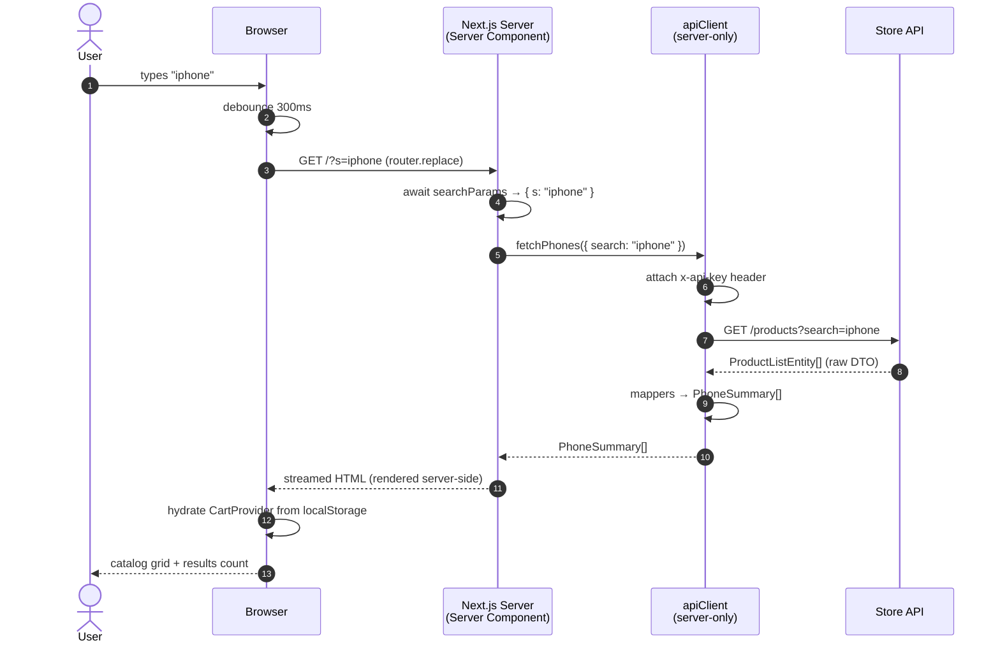
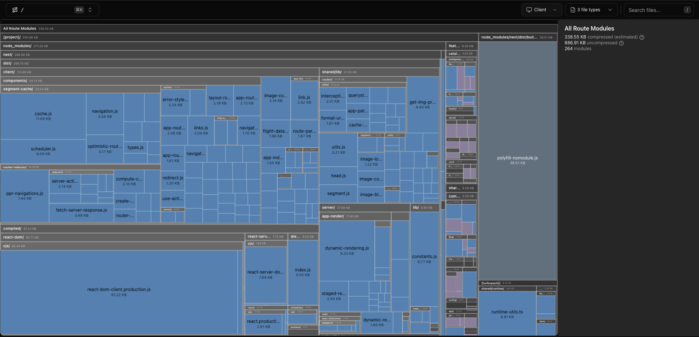
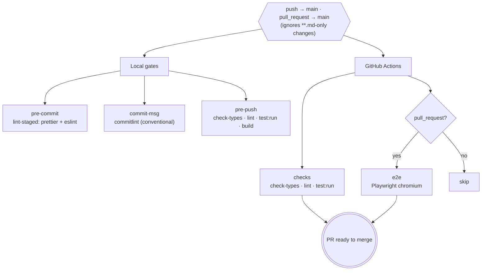

# Mobile Phone Catalog

[Napptilus Tech Labs](https://www.napptilus.com/) frontend challenge — **Zara Web Challenge**.
A server-rendered smartphone catalog: browse, search, configure variants, and manage a persistent cart — built on **Next.js 16 (App Router) + React 19 + TypeScript**.

> CSS Modules + design tokens · zero runtime styling.

**DEMO =>** [https://zara-next-challenge.vercel.app/](https://zara-next-challenge.vercel.app/)

## Table of contents

|                  |                                                                                                                           |
| ---------------- | ------------------------------------------------------------------------------------------------------------------------- |
| **Setup**        | [Getting started](#getting-started) · [Scripts](#scripts)                                                                 |
| **Architecture** | [Decisions](#architectural-decisions) · [Request lifecycle](#request-lifecycle) · [Project structure](#project-structure) |
| **Quality**      | [Bundle analysis](#bundle-analysis) · [CI/CD](#cicd)                                                                      |
| **Other**        | [Extra](#extra) · [References](#references) · [Author](#author)                                                           |

---

## Getting started

**Requirements:** [Bun](https://bun.sh) ≥ 1.1 (lockfile is `bun.lock`).

```bash
bun install
cp .env.example .env.local    # fill X_API_KEY
bun run dev                   # http://localhost:3000
```

Server-only env vars (never `NEXT_PUBLIC_` — Next.js strips them from the client bundle):

```env
API_BASE_URL=https://prueba-tecnica-api-tienda-moviles.onrender.com
X_API_KEY=your-api-key
```

`X_API_KEY` is injected as the `x-api-key` header inside `shared/lib/api/apiClient.ts` and never reaches the client. See [.env.example](./.env.example).

---

## Architectural decisions

A brief rationale for the main choices — and what I deliberately left out.

### Next.js 16 App Router

Based on my experience with recent Next.js versions in past projects, I chose the App Router to lean on **Server Components** and the advantages they bring to an e-commerce surface — which is ultimately what this challenge is about: performance, SEO, and keeping data-fetching and API secrets on the server. The catalog and detail pages render entirely on the server; `'use client'` is reserved for the few islands that genuinely need state or browser APIs (the cart provider, the search input, the detail selectors).

### CSS Modules + design tokens

An easy call once Next.js was chosen — it pairs naturally with SSR with zero runtime cost. I've worked more with styled-components and CSS-in-JS, especially during my time at RedPoints, but for server-side rendering CSS Modules feel like the safer bet here. They combine cleanly with CSS custom properties and a single design-token file ([`shared/styles/theme/tokens.css`](./shared/styles/theme/tokens.css)) that holds every color, spacing, and typography value as a `:root` variable. [`clsx`](https://github.com/lukeed/clsx) is the only sanctioned way to compose `className`.

### Bun

My package manager of choice — it's fast, reliable, and secure. I considered pnpm, but Bun wins for me on ergonomics and speed.

### Vitest + Playwright

These have been part of my stack for the last few years, and I see them as the natural evolution of Jest and Cypress. The syntax is familiar enough that adapting is trivial, with less boilerplate and noticeably faster execution. Vitest handles unit and integration tests against jsdom with v8 coverage; Playwright drives real-browser E2E against the live API.

### What I left out — and why

TanStack Query, Redux/Zustand, Tailwind, Sass, CSS-in-JS, Axios, and Jest are all absent. The App Router covers data-fetching on the server, a single Context handles the only piece of client state (the cart), and native `fetch` is enough — adding those libraries would inflate the surface area without solving a problem this scope has.

---

## Request lifecycle

All catalog and detail data is fetched on the server through the `shared/lib/api/` service layer — features and pages never call `fetch` directly, and the `x-api-key` header stays server-side. Raw API DTOs are mapped to domain types before reaching any component.



The detail page follows the same path via `fetchPhoneById(id)`, mapping the full `ProductEntity` (specs, color/storage options, similar products) before passing serializable props to the client selectors.

---

## Project structure

In most of the SaaS apps I've worked on lately I lean on a **hexagonal architecture** adapted to the frontend — splitting domain logic, ports, and adapters so the core stays framework-agnostic<sup>1</sup>. But honestly, for a challenge this focused on just three features, that level of indirection is overkill. So here I went with a **screaming architecture** in the form of a feature-driven layout<sup>2</sup> — the folder names read like the product: `catalog`, `detail`, `cart`. Domain code lives in `features/`, routing only in `app/`, and cross-cutting modules in `shared/`.

```
app/                      App Router — routing only
├── layout.tsx            Root layout: <html>, fonts, <CartProvider>, globals.css
├── (catalog)/page.tsx    /          — Catalog (Server Component)
├── phone/[id]/page.tsx   /phone/:id — Detail (Server Component)
├── cart/page.tsx         /cart      — Cart (Client Component, reads CartContext)
├── loading.tsx · not-found.tsx · error.tsx
└── globals.css           CSS entry — @import theme + base only
features/
├── catalog/              SearchInput, PhoneGrid, ResultsCount, CatalogClient
├── detail/               ProductHero, PhoneGallery, Color/StorageSelector, AddToCart, Specifications, SimilarProducts
└── cart/                 CartView, CartList, CartItem, CartSummary, RemoveButton
shared/
├── components/           Header, Bag, Button, Carousel, Container, Logo, PhoneCard
├── context/              CartContext.tsx (the only 'use client' provider)
├── hooks/                useDebounce, useCarousel
├── config/               site.ts, routes.ts (ROUTES + SEARCH_PARAM single source of truth)
├── lib/                  api/ (apiClient, mappers, index), types/, utils/
└── styles/               base.css + theme/tokens.css (design tokens)
e2e/                      Playwright specs (catalog, detail, cart)
```

**Server vs Client** — pages and presentational components are Server Components by default; `'use client'` is added only where state, effects or browser APIs are required (`CartContext`, `SearchInput`, `ProductHero` + selectors, `cart/page.tsx`, `error.tsx`).

**The three surfaces** are split across the routing tree:

- **Catalog (`/`)** — a grid of the first 20 phones with live search. The input is debounced 300 ms and the query lives in the URL (`/?s=…`); the server filters through the API's `?search=` param — no client-side filtering. A results counter is derived from the response length.
- **Detail (`/phone/[id]`)** — gallery, color/storage selectors with real-time price and image updates, specs, similar products, and an add-to-cart button that stays disabled until a storage is picked. Color defaults to the first option; the base price renders as "from X" until storage is chosen.
- **Cart (`/cart`)** — line items with per-line removal, running total, and a continue-shopping link.

---

## Bundle analysis

Next.js 16 ships a Turbopack-native bundle analyzer (`next experimental-analyze`) — no extra dependency required. `bun run analyze` opens an interactive treemap in the browser where you can drill into every chunk and module.

Because the app is feature-driven, the treemap reads like the product itself: the client-side JS is split across the `catalog`, `detail`, and `cart` islands, with `shared/` housing the cross-cutting pieces (the `CartContext` provider, the UI primitives). That makes it easy to spot a feature leaking code into another route's bundle, or a shared utility pulling in more than it should — which ties back directly to the `'use client'` boundaries described in [Project structure](#project-structure).

<p align="center">
  
</p>

<p align="center"><em>Bundle analyzer treemap</em></p>

```bash
bun run analyze              # interactive treemap in the browser
bun run analyze -- --output  # static report → .next/diagnostics/analyze
```

---

## CI/CD

Every change is gated locally (Husky) **and** in CI (GitHub Actions). Workflow: [`.github/workflows/ci.yml`](./.github/workflows/ci.yml) — triggers on **push** and **pull_request** to `main`, ignoring markdown-only changes (`paths-ignore: '**.md'`).



| Job        | Steps                               | Runs on   |
| ---------- | ----------------------------------- | --------- |
| **checks** | `check-types` → `lint` → `test:run` | push + PR |
| **e2e**    | install chromium → `test:e2e`       | PR only   |

**Secrets** (Settings → Secrets and variables → Actions): `X_API_KEY` (build + E2E against the store API).

---

## Extra

The goal was an optimal, functional version within the challenge's scope — using the fewest external libraries possible to keep performance lean. A few additions felt like natural next steps but fell outside the scope:

- **Animation libraries** (Motion) or the native **View Transitions API** for catalog→detail shared-element transitions and grid reflow.
- **SonarQube** or **CodeRabbit** for automated best-practice and code-smell analysis on pull requests.
- **Storybook** to document and isolate the shared component library.
- **Mock Service Worker (MSW)** or a local mock server to mock API endpoints during E2E tests, ensuring full test isolation and eliminating dependencies on external API availability and image hosting domains.

Honestly, none of these are what the challenge is about, and adding them would be premature optimization — knowing what to leave out is part of the job.

---

## References

1. <small>Jotagep — _Hexagonal Architecture in React: A Practical Guide_, jotagep.com (Oct 2024). [jotagep.com/blog/hexagonal-architecture-frontend](https://jotagep.com/blog/hexagonal-architecture-frontend/)</small>
2. <small>Oleksii Kyrychenko — _Feature-Based Architecture in React: A Structure That Scales Without Turning Into Chaos_, DEV Community (2026). [dev.to/alexey79/feature-based-architecture-in-react-…](https://dev.to/alexey79/feature-based-architecture-in-react-a-structure-that-scales-without-turning-into-chaos-32mo)</small>

---

## Author

Made with ❤️ by [Jotagep](https://jotagep.com) — [GitHub](https://github.com/jotagep)
